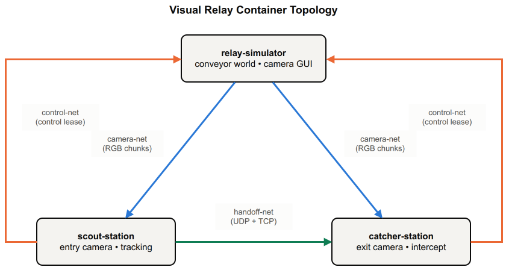

# Visual Relay

Containerizing a distributed cross-camera robot vision system.

This assignment simulates a realistic container deployment: one simulator
shows the authoritative conveyor world and publishes camera data, two
workstation containers show their own first-person camera views, and the
services coordinate over separate Docker networks.

## Requirements

- Linux desktop
- Docker Engine
- Docker Compose v2
- Wayland or X11/XWayland
- x86-64

The runtime GUI containers require a real Linux display server. There is no
headless GUI fallback.

## What You Will Run

Three containers, three isolated Docker networks, one data plane per network:



- **camera-net** — `relay-simulator` streams RGB camera datagrams to both stations.
- **handoff-net** — `scout-station` sends UDP track updates and a TCP identity
  handoff to `catcher-station`.
- **control-net** — the stations hold a control lease back with `relay-simulator`.

`relay-simulator` sits on camera-net and control-net. The two stations sit on
all three. All three networks are internal only, so no service needs to reach
the internet at runtime.

## 0. Your Task

The C++ system is finished. `scripts/`, `grader/`, and the
`compose.gui-*.yaml` display overlays need no changes and are off limits.
What you get is the **worst `Dockerfile`, `compose.yaml`, and
`.dockerignore` that still run**: one image with the toolchain, all sources,
and all three services inside, deployed three times onto one flat network
with default privileges and no supervision.

Your assignment: make `./grader/grade.sh` fully green. The grader's output
is the spec. Run it first, read every `[FAIL]` line, fix one at a time.
It will demand, at minimum:

- a real multi-stage build, fast reproducible rebuilds, a working
  `.dockerignore`, and a `test` build target that runs the unit tests
- runtime images that are small, non-root, and free of toolchain and sources
- the three-network topology described above, real per-service healthchecks,
  hardened runtime containers, and explicit resource limits

How you get each one there is the exercise. Compare `docker image ls`
before and after. The difference is the point.

## 1. Run It

If the scripts are not executable after checkout, fix their permissions first:

```bash
chmod +x scripts/*.sh grader/*.sh
```

```bash
./scripts/run-gui.sh
```

The script chooses Wayland when a Wayland socket is available, otherwise it uses
X11/XWayland. It builds the images and starts all three runtime services. All
three receive the host GUI resources needed by SDL3. The simulator owns the
conveyor display; `scout-station` and `catcher-station` render only their
respective camera streams and overlays.

Stop it with:

```bash
docker compose --profile runtime down --remove-orphans
```

## 2. Grade It

```bash
./grader/grade.sh
```

This is the only check you need to run. It builds and exercises your container
setup end to end and prints one scored report:

```text
Phase 1  static Dockerfile/compose design       (multi-stage builds, cache mounts,
                                                  network separation, non-root users,
                                                  resource limits, healthchecks, ...)
Phase 2  containerized build + unit tests        (protocol/scene tests run inside Docker)
Phase 3  runtime image hygiene                   (no compilers/sources leak into runtime images)
Phase 4  runtime health                          (all three services boot and pass healthchecks)
Phase 5  automated fault recovery                (UDP pause, TCP handoff cut, service restarts)
```

Every check prints `[PASS]` or `[FAIL]` with what it found, and the script
ends with a `TOTAL SCORE: passed/total`. A perfect score means the container
design is complete; any `[FAIL]` line tells you exactly what to fix. Phases 4
and 5 start the real GUI containers (same as `run-gui.sh`) and tear them down
automatically when the script exits.

## Manual Fault Injection (Optional)

`grade.sh` already runs these scenarios for you. If you want to trigger one
by hand while watching the GUI windows, start the system with `run-gui.sh` in
one terminal and run this in another:

```bash
./scripts/inject-network-fault.sh udp-loss 2
./scripts/inject-network-fault.sh tcp-handoff-cut
./scripts/inject-network-fault.sh scout-restart
./scripts/inject-network-fault.sh catcher-restart
./scripts/inject-network-fault.sh simulator-restart
```
