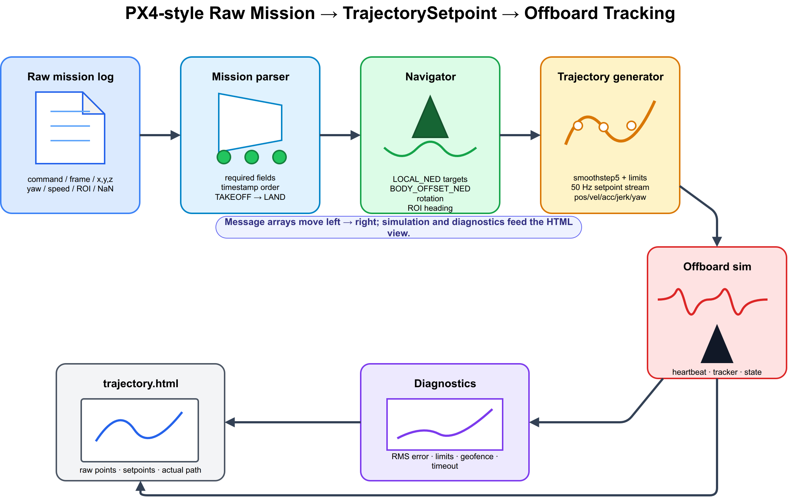
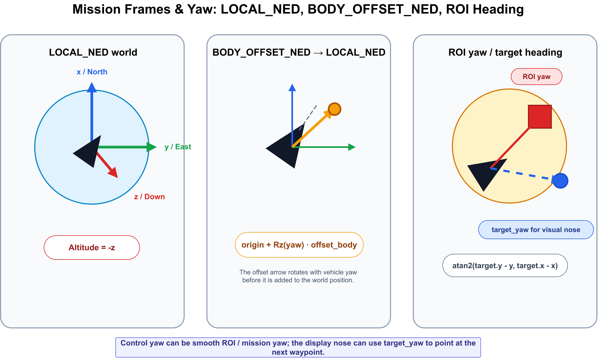
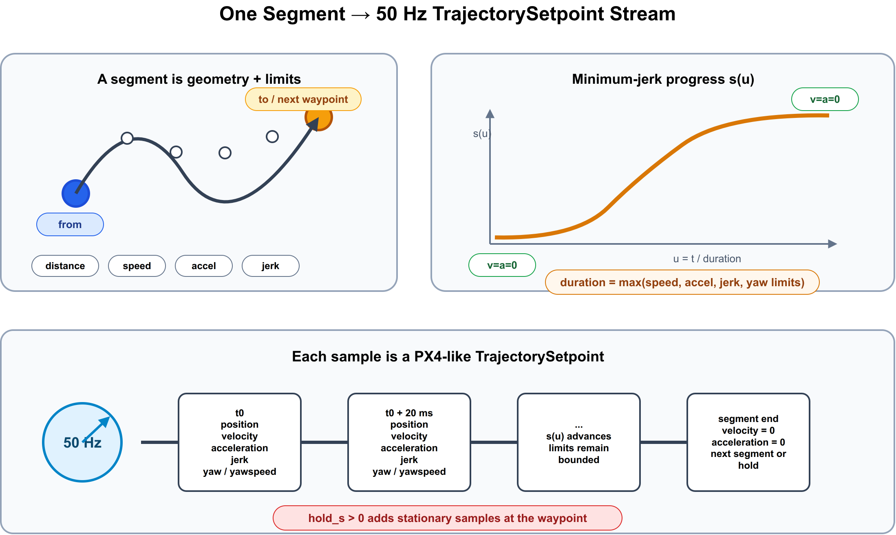

# Week 4 Homework: PX4-Style Raw Mission To TrajectorySetpoint

This project converts a PX4-like raw mission log into a smooth multicopter
`TrajectorySetpoint` stream, then simulates an offboard-style tracker following
that stream.

The input is intentionally closer to raw GCS/PX4 mission data than a clean
array of poses: commands, frames, timestamps, speed changes, ROI fields, and
`NaN` for unset fields. The positioned mission items form a closed regular
octagon in the XY plane so you can compare the raw waypoint geometry against
the generated smooth trajectory in `trajectory.html`.

## System Overview



The pipeline is a straight line, one stage feeding the next:

1. **Mission Parser** (`mission_io.hpp`) reads and validates the raw CSV.
2. **Navigator** (`trajectory_generator.hpp: build_navigator_setpoints`)
   resolves each mission item into a world-frame waypoint.
3. **Trajectory Generator** (`trajectory_generator.hpp: build_trajectory`)
   interpolates between waypoints into a fixed-rate `TrajectorySetpoint`
   stream.
4. **Offboard Simulation** (`offboard_sim.hpp`) simulates a vehicle tracking
   that stream.
5. **Diagnostics** (`diagnostics.hpp`) checks the result against PX4-style
   limits and produces a pass/fail report.
6. **Output** (`html_plot.hpp` + `main.cpp`) writes `trajectory.html` and
   prints the report.

## Coordinate Frames and Yaw



`LOCAL_NED` is the internal world frame. `BODY_OFFSET_NED` waypoints are
resolved relative to the current position and yaw. `ROI_WAYPOINT` and
`LOITER_TIME` items compute yaw so the vehicle nose points at the ROI target.

## How One Segment Is Built



Between every pair of waypoints, the generator sizes a duration from the
distance/turn and the velocity/acceleration/jerk limits, then samples a
quintic (`smoothstep5`) profile at a fixed rate so position, velocity,
acceleration, jerk, yaw, and yawspeed all start and end at rest. A `hold_s`
on the target waypoint appends a stationary hold segment.

## Build and Run

```bash
conan profile detect --force
conan install . --output-folder=build --build=missing -s build_type=Release -s compiler.cppstd=20
cmake -S . -B build -G Ninja -DCMAKE_TOOLCHAIN_FILE=build/conan_toolchain.cmake -DCMAKE_BUILD_TYPE=Release
cmake --build build
./build/px4_style_trajectory_homework
```

The program writes `trajectory.html` with raw mission items, generated setpoints,
actual vehicle motion, and diagnostics charts.

## Raw Mission CSV

The parser expects:

```text
seq,timestamp_us,command,frame,x,y,z,yaw_deg,acceptance_radius_m,hold_s,cruise_speed_mps,loiter_radius_m,roi_x,roi_y,roi_z
```

Supported commands:

- `TAKEOFF`
- `WAYPOINT`
- `ROI_WAYPOINT`
- `CHANGE_SPEED`
- `LOITER_TIME`
- `LAND`

Supported frames:

- `LOCAL_NED`
- `BODY_OFFSET_NED`

Use `NaN` for fields that are intentionally unset.
